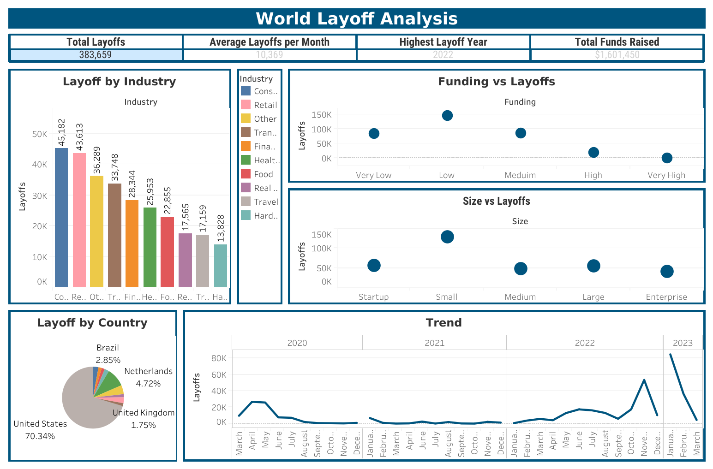

# World Layoffs Analysis (SQL + Tableau)

## Project Overview

This project analyzes global layoffs data using SQL and Tableau to uncover trends, identify the most impacted industries and countries, and explore factors contributing to layoffs.

The project includes:
- Data cleaning and transformation using SQL  
- Exploratory data analysis (EDA)  
- Trend and factor analysis  
- Dashboard creation in Tableau  

## Business Questions

This analysis aims to answer:

- Which countries were the most impacted?  
- Which industries experienced the highest layoffs?  
- Are there factors that increase the likelihood of layoffs?  
- What are the trends in layoffs over time?  

## Dashboard

## Data Cleaning & Preparation

- Created a working copy of the raw dataset  
- Removed duplicate records using `ROW_NUMBER()`  
- Standardized data:
  - Trimmed company names  
  - Unified industry categories (e.g., Crypto)  
  - Converted date column to proper date format  
  - Cleaned country names (e.g., removed trailing characters)  
- Handled missing values:
  - Replaced blanks with NULL  
  - Filled missing industry values using related records  
- Removed irrelevant records where both layoff metrics were null  
- Dropped helper columns used during cleaning  

## Data Analysis

- Used SQL queries to explore layoffs across multiple dimensions  
- Applied:
  - Aggregations for KPIs  
  - CTEs for structured analysis  
  - Window functions for deeper insights  
  - Case statements for categorization (company size, funding levels)  

## Data Visualization

- Imported cleaned data into Tableau  
- Built visualizations for:
  - Layoffs by industry  
  - Layoffs by country  
  - Trends over time  
  - Funding vs layoffs  
  - Company size vs layoffs  
- Combined visuals into a single dashboard with KPIs  

## Key Insights

- 🇺🇸 The **United States** accounts for over **70% of global layoffs**  
- Most impacted industries:
  - Consumer  
  - Retail  
  - Transportation  
  - Finance  
  - Healthcare  
- Companies with **lower funding and smaller size** tend to have higher layoffs  
- Even highly funded companies experienced significant layoffs  
- Layoffs trend:
  - Major spike in **November 2022**  
  - Drop in December  
  - Surge again in early 2023  
  - Gradual decline afterward  

## Business Insights

- Layoffs are influenced by **macroeconomic conditions**, not just funding  
- Industries tied to **consumer demand** are more volatile  
- Smaller companies are more vulnerable to economic shocks  
- Workforce planning should consider **market cycles and funding levels**  

## Tools & Technologies

- SQL (MySQL)
- Tableau

